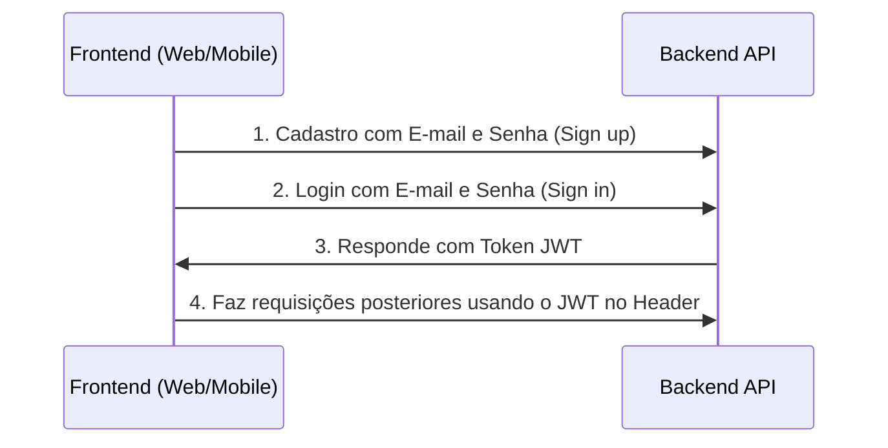
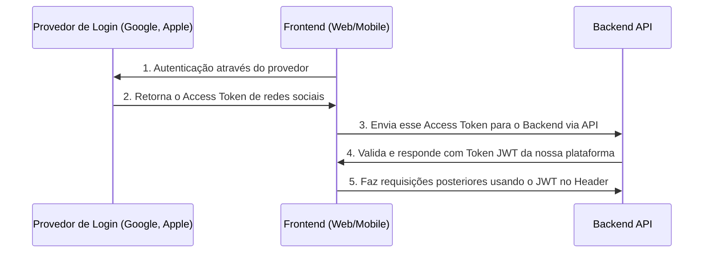

# Autenticação

## Tabela de Conteúdos <!-- omit in toc -->

- [Fluxo de Autenticação por E-mail](#fluxo-de-autenticação-por-e-mail)
- [Fluxo de Autenticação com Login Social (Google, Apple, etc)](#fluxo-de-autenticação-com-login-social)
- [Configurando a Autenticação](#configurando-a-autenticação)
- [Sobre a Estratégia JWT](#sobre-a-estratégia-jwt)
- [Fluxo do Refresh Token (Atualização de Token)](#fluxo-do-refresh-token)
- [Logout](#logout)
- [Perguntas Frequentes](#perguntas-frequentes)

---

## Fluxo de Autenticação por E-mail

O sistema de Login padrão permite criar conta e entrar usando E-mail e Senha tradicional.



## Fluxo de Autenticação com Login Social

O projeto já está estruturado para suportar login fácil através do Apple, Facebook e Google.



Para autenticar com serviços externos:
1. No Frontend, o usuário se loga usando o SDK do Google/Apple, resultando num Access token.
2. Você chama uma das rotas (`/api/v1/auth/google/login`, `/api/v1/auth/apple/login`) para gerar uma sessão no nosso Backend.

## Configurando a Autenticação

As chaves JWT precisam ser seguras e secretas. Se necessário reconstruí-las no seu computador local ou produção, rode no terminal:

```bash
node -e "console.log('\nAUTH_JWT_SECRET=' + require('crypto').randomBytes(256).toString('base64') + '\n\nAUTH_REFRESH_SECRET=' + require('crypto').randomBytes(256).toString('base64') + '\n\nAUTH_FORGOT_SECRET=' + require('crypto').randomBytes(256).toString('base64') + '\n\nAUTH_CONFIRM_EMAIL_SECRET=' + require('crypto').randomBytes(256).toString('base64'));"
```

E coloque o retorno diretamente no seu arquivo `.env`.

> **Logins Sociais (Google/Apple):**
> Você vai precisar criar apps nesses respectivos portais para extrair os Tokens de Configuração (como `GOOGLE_CLIENT_ID` ou `APPLE_APP_AUDIENCE`) para preencher no `.env`.

## Sobre a Estratégia JWT

A API usa JWTs stateless com curto tempo de expiração. O payload contém as informações essenciais do usuário (ID, role) e é assinado com uma chave secreta. Toda informação necessária para autorização pode ser consultada via `request.user` nos controllers.

## Fluxo do Refresh Token

Para evitar pedir a senha do usuário a toda hora de forma segura:
1. Após logar (`POST /api/v1/auth/email/login`) enviaremos junto do `token` original, um `refreshToken`.
2. Em requisições regulares, passe o `token` em `Authorization: Bearer <T>`.
3. Quando esse `token` expirar (ficar inválido depois do período máximo configurado), o Client envia o `refreshToken` para a rota (`POST /api/v1/auth/refresh`). A API te devolverá um novo token fresco.

O banco de dados do Backend salva ativamente uma tabela de `sessions` atrelando sessões reais aos dispotivos. Se a hash do refresh-token coincidir de forma válida, a sessão é mantida.

## Logout

1. Chame a rota `/api/v1/auth/logout`.
2. No Frontend, limpe/delete o JWT armazenado nos Cookies, LocalStorage ou Async Storage.

## Perguntas Frequentes

### O que acontece com o JWT após o Logout?
O `refreshToken` é invalidado imediatamente no Logout (a session é deletada do banco). O JWT de acesso tem um tempo de expiração curto configurado via `AUTH_JWT_TOKEN_EXPIRES_IN`. Após o Logout, o usuário não consegue obter novos tokens.
