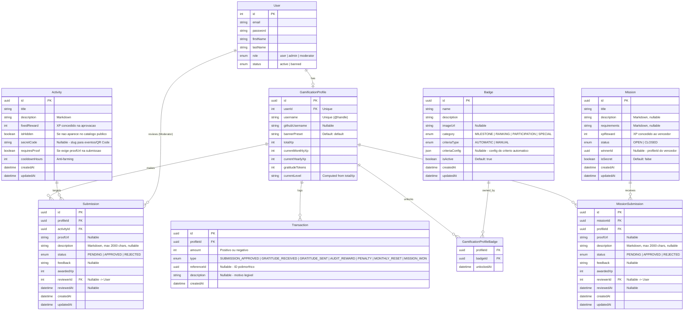

# Modelagem de Dados (Engajamento & Gamificação)

Atualizado em: 2026-04-18

---

## Diagrama ER (Mermaid)



---

## Dicionário de Entidades

### `User` (Autenticação Base — Existente)
Focado estritamente na identidade digital do membro. Gerenciado pelo módulo de autenticação do boilerplate NestJS.

- `role` (Enum: `user`, `admin`, `moderator`) — controla acesso às rotas protegidas
- `status` (Enum: `active`, `banned`) — membros banidos não conseguem logar

---

### `GamificationProfile` (Perfil e Carteira do Usuário)
A representação gamificada do membro da comunidade Devs Tocantins.

- `username` (String, Unique) — @handle para menções e transferências de tokens
- `githubUsername` (String, Nullable) — exibido no perfil público
- `bannerPreset` (String) — preset de banner visual no perfil (ex: `default`, `gold`)
- `totalXp` (Int) — XP histórico acumulado; base para o level e o ranking global
- `currentMonthlyXp` (Int) — XP do ciclo atual; reseta dia 1 de cada mês via cron
- `currentYearlyXp` (Int) — XP do ano corrente; reseta dia 1 de janeiro via cron
- `gratitudeTokens` (Int) — cota disponível para transferir; reseta dia 1 de cada mês
- `currentLevel` (String) — calculado a partir de `totalXp`:

| Nível | XP mínimo |
|-------|-----------|
| Novato | 0 |
| Contribuidor | 500 |
| Colaborador Ativo | 2.000 |
| Referência | 6.000 |
| Mentor | 15.000 |
| Lenda | 35.000 |

---

### `Activity` (Catálogo Core de Pontuação)
Atividades pré-mapeadas disponíveis para submissão.

- `description` — markdown; renderizado com MarkdownContent no frontend
- `fixedReward` (Int) — XP concedido ao aprovar; o moderador pode ajustar na revisão
- `isHidden` (Boolean) — se `true`, não aparece em `GET /activities`; só via `secretCode`
- `secretCode` (String, Nullable) — slug único para acesso offline/QR Codes em eventos
- `cooldownHours` (Int) — sistema anti-farming; bloqueia nova submissão da mesma atividade pelo mesmo perfil

---

### `Submission` (Solicitação de Pontos do Usuário)
Quando o usuário executa uma `Activity` e solicita reconhecimento.

- `description` (String, Nullable) — markdown sanitizado (max 2000 chars); aceita apenas ASCII imprimível + Latin Extended (sem emojis/Unicode especial)
- `awardedXp` (Int) — XP concedido (geralmente herda de `Activity.fixedReward`, mas o moderador pode sobrescrever)
- `reviewerId` (Int, FK -> User) — ID do moderador que revisou
- Ao **aprovar**: gera `Transaction(SUBMISSION_APPROVED)` para o submitter, credita XP no perfil, gera `Transaction(AUDIT_REWARD)` para o moderador (+10 XP)

---

### `Transaction` (Extrato Imutável)
Motor financeiro dos pontos. Toda mutação no perfil gera uma Transaction.

- `amount` (Int) — positivo (crédito) ou negativo (débito)
- `type` (Enum):
  - `SUBMISSION_APPROVED` — XP de atividade aprovada
  - `GRATITUDE_RECEIVED` — tokens recebidos de outro membro (+1 XP por token recebido, afeta `currentMonthlyXp` e `totalXp`)
  - `GRATITUDE_SENT` — débito no `gratitudeTokens` do remetente (não afeta XP)
  - `AUDIT_REWARD` — +10 XP ganho pelo moderador ao revisar submissão
  - `PENALTY` — XP deduzido pelo admin via modal de penalidade
  - `MONTHLY_RESET` — log do reset mensal de tokens/XP mensal (via cron)
  - `MISSION_WON` — XP de missão vencida
- `referenceId` (UUID, Nullable) — chave polimórfica apontando para a entidade de origem (Submission, Transaction da contraparte, etc.)

---

### `Badge` (Catálogo de Medalhas)

- `category` (Enum):
  - `MILESTONE` — marcos de XP ou contribuições acumuladas
  - `RANKING` — posições em rankings mensais/anuais
  - `PARTICIPATION` — participação em eventos ou missões
  - `SPECIAL` — badges manuais para casos excepcionais
- `criteriaType` (Enum):
  - `AUTOMATIC` — verificado pelo cron ou ao aprovar submissão
  - `MANUAL` — concedido pelo admin via `POST /badges/grant`
- `criteriaConfig` (JSON, Nullable) — configuração para critérios automáticos:
  ```json
  { "type": "submissions_approved", "threshold": 10 }
  { "type": "total_xp", "threshold": 500 }
  { "type": "monthly_ranking_top", "threshold": 3 }
  ```

---

### `GamificationProfileBadge` (Conquistas Desbloqueadas)
Tabela associativa Many-to-Many registrando quando cada badge foi desbloqueado por um perfil.

---

### `Mission` (Missão Única com Vencedor)
Desafio com recompensa de alto valor e vencedor único.

- `description` e `requirements` — markdown; renderizados no frontend com MarkdownContent
- `status` (Enum): `OPEN` (aceitando submissões) | `CLOSED` (encerrada)
- `winnerId` (UUID, Nullable) — profileId do vencedor; preenchido ao aprovar uma submissão
- `isSecret` (Boolean) — se `true`, não aparece em `GET /missions`
- Ao **aprovar** uma submissão: define `winnerId`, seta `status: CLOSED`, gera `Transaction(MISSION_WON)`, rejeita automaticamente todas as outras submissões pendentes da missão

---

### `MissionSubmission` (Submissão para Missão)
Análoga à `Submission`, mas vinculada a uma `Mission` em vez de uma `Activity`.

- `description` (String, Nullable) — markdown sanitizado, max 2000 chars
- `awardedXp` (Int) — herda de `Mission.xpReward` ao aprovar
- Ao aprovar: gera `Transaction(MISSION_WON)` para o vencedor com o XP da missão
