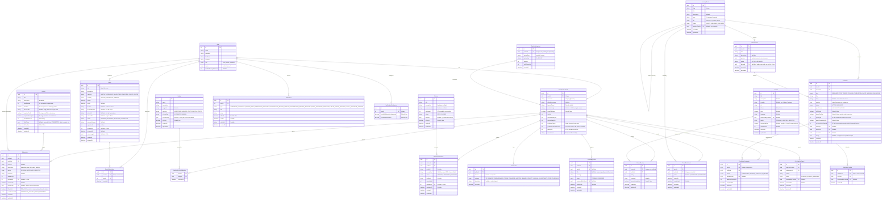

# Modelagem de Dados (legado.dev — Engajamento & Gamificação)

Atualizado em: 2026-07-25

---

## Diagrama ER (Mermaid)


```mermaid
erDiagram
    User ||--o| GamificationProfile : has
    GamificationProfile ||--o{ Submission : makes
    GamificationProfile ||--o{ Transaction : logs
    GamificationProfile ||--o{ GamificationProfileBadge : unlocks
    GamificationProfile ||--o{ MissionSubmission : makes
    GamificationProfile ||--o{ TrackEnrollment : enrolls
    GamificationProfile ||--o{ TrackItemCompletion : completes
    GamificationProfile ||--o{ CourseReview : writes
    GamificationProfile ||--o{ TrackSuggestion : suggests
    GamificationProfile ||--o{ ContributionReport : reports
    Activity ||--o{ Submission : targets
    Badge ||--o{ GamificationProfileBadge : owned_by
    Mission ||--o{ MissionSubmission : receives
    User ||--o{ Submission : "reviews (Moderator)"
    User ||--o{ Event : organizes
    User ||--o{ EventSubscription : subscribes
    User ||--o{ Notification : receives
    User ||--o| NotificationPreference : configures
    LearningTrack ||--o{ TrackSection : contains
    LearningTrack ||--o{ TrackItem : contains
    LearningTrack ||--o{ TrackEnrollment : enrolled_in
    LearningTrack ||--o| LearningTrack : "requires (pre-req)"
    TrackSection ||--o{ TrackItem : contains
    TrackItem ||--o{ TrackItemCompletion : completed_by
    Course ||--o{ CourseReview : reviewed_by
    Course ||--o{ TrackItemCourse : linked_in
    Event ||--o{ EventSubscription : has
    RankingSnapshot }o--|| GamificationProfile : snapshots

    User {
        int id PK
        string email
        string password
        string firstName
        string lastName
        enum role "user | admin | moderator"
        enum status "active | banned"
        int lastNotifiedLegalVersion "Nullable"
    }

    GamificationProfile {
        uuid id PK
        int userId FK "Unique"
        string username "Unique (@handle)"
        string githubUsername "Nullable"
        string bannerPreset "Default: default"
        string avatarConfig "Nullable - JSON config do avatar"
        boolean showFullName "Default: false"
        int totalXp
        int currentMonthlyXp
        int currentYearlyXp
        int gratitudeTokens "Saldo disponivel para doar"
        int gratitudeTokensReceived "Contador historico de tokens recebidos"
        int journeyXp "XP de Jornada via trilhas"
        string currentLevel "Computed from totalXp"
    }

    Activity {
        uuid id PK
        string title
        string description "Markdown"
        int fixedReward "XP concedido na aprovacao"
        boolean isHidden "Se nao aparece no catalogo publico"
        string secretCode "Nullable - slug para eventos/QR Code"
        boolean requiresProof "Se exige proofUrl na submissao"
        boolean requiresDescription "Se exige descricao na submissao"
        int cooldownHours "Anti-farming"
        json effortTiers "Nullable - array de {level: P|M|G|EPICO, label, example, xp}"
        boolean isFreeform "Default: false"
        datetime createdAt
        datetime updatedAt
    }

    Submission {
        uuid id PK
        uuid profileId FK
        uuid activityId FK
        string proofUrl "Nullable"
        string description "Markdown, max 2000 chars, nullable"
        enum status "PENDING | APPROVED | REJECTED"
        string feedback "Nullable"
        int awardedXp
        int reviewerId FK "Nullable -> User"
        datetime reviewedAt "Nullable"
        uuid trackItemId FK "Nullable - marco de trilha vinculado"
        boolean isTestOut "Default: false - pulou o marco autodeclarando dominio"
        enum contributionKind "COMMUNITY_ACTIVITY | TRACK_PROGRESS"
        datetime createdAt
        datetime updatedAt
    }

    Transaction {
        uuid id PK
        uuid profileId FK
        int amount "Positivo ou negativo"
        enum category "XP_REWARD | TOKEN_REWARD | TOKEN_TRANSFER | AUDITOR_REWARD | PENALTY | MANUAL_ADJUSTMENT | STORE_PURCHASE"
        string description "Nullable - motivo legivel"
        datetime createdAt
    }

    Badge {
        uuid id PK
        string name
        string description
        string imageUrl "Nullable"
        enum category "MILESTONE | RANKING | PARTICIPATION | SPECIAL"
        enum criteriaType "AUTOMATIC | MANUAL"
        json criteriaConfig "Nullable - config do criterio automatico"
        boolean isActive "Default: true"
        datetime createdAt
        datetime updatedAt
    }

    GamificationProfileBadge {
        uuid profileId FK
        uuid badgeId FK
        datetime unlockedAt
    }

    Mission {
        uuid id PK
        string title
        string description "Markdown, nullable"
        string requirements "Markdown, nullable"
        int xpReward "XP concedido ao vencedor"
        enum status "OPEN | CLOSED"
        uuid winnerId "Nullable - profileId do vencedor"
        boolean isSecret "Default: false"
        datetime createdAt
        datetime updatedAt
    }

    MissionSubmission {
        uuid id PK
        uuid missionId FK
        uuid profileId FK
        string proofUrl "Nullable"
        string description "Markdown, max 2000 chars, nullable"
        enum status "PENDING | APPROVED | REJECTED"
        string feedback "Nullable"
        int awardedXp
        int reviewerId FK "Nullable -> User"
        datetime reviewedAt "Nullable"
        datetime createdAt
        datetime updatedAt
    }

    LearningTrack {
        uuid id PK
        string slug "Unique"
        string title
        string description "Nullable"
        string area "Ex: backend, frontend"
        enum tier "ALICERCE | PILAR | ARCO"
        enum status "DRAFT | PUBLISHED | ARCHIVED"
        uuid requiresTrackId FK "Nullable - pre-requisito"
        datetime createdAt
        datetime updatedAt
    }

    TrackSection {
        uuid id PK
        uuid trackId FK
        string title
        string description "Nullable"
        float position "Indice fracionario de ordenacao"
        enum status "ACTIVE | ARCHIVED"
        uuid badgeId FK "Nullable - badge concedido ao concluir etapa"
        datetime createdAt
        datetime updatedAt
    }

    TrackItem {
        uuid id PK
        uuid trackId FK
        uuid sectionId FK
        enum type "RESOURCE | TEXT | PROOF | COURSE_COMPLETION | EVENT | MISSION | CHECKPOINT"
        string title
        string body "Nullable - texto inline do marco"
        float position "Indice fracionario de ordenacao"
        enum status "ACTIVE | ARCHIVED"
        enum proofFormat "LINK | PHOTO | EITHER"
        boolean isOptional "Default: false"
        boolean allowsTestOut "Default: false - permite pular com prova"
        int journeyXp "XP de Jornada concedido ao concluir"
        boolean grantsCommunityXp "Default: false"
        int communityXpReward "XP de Comunidade quando grantsCommunityXp=true"
        uuid activityId FK "Nullable"
        uuid missionId FK "Nullable"
        uuid courseId FK "Nullable"
        json config "Nullable - configuracao especifica do tipo"
        datetime createdAt
        datetime updatedAt
    }

    TrackEnrollment {
        uuid id PK
        uuid trackId FK
        uuid profileId FK "Unique com trackId"
        enum status "ACTIVE | COMPLETED | ABANDONED"
        datetime startedAt
        datetime completedAt "Nullable"
        datetime createdAt
        datetime updatedAt
    }

    TrackItemCompletion {
        uuid id PK
        uuid itemId FK "Unique com profileId"
        uuid profileId FK
        enum status "COMPLETED | SKIPPED_TESTOUT | IN_REVIEW"
        uuid submissionId FK "Nullable"
        int awardedJourneyXp
        datetime completedAt
        datetime createdAt
        datetime updatedAt
    }

    TrackSuggestion {
        uuid id PK
        uuid profileId FK
        uuid trackId FK "Nullable"
        string title "Nullable - nome sugerido para trilha nova"
        string message
        enum status "PENDING | REVIEWED"
        uuid reviewedByProfileId FK "Nullable"
        datetime reviewedAt "Nullable"
        datetime createdAt
        datetime updatedAt
    }

    Course {
        uuid id PK
        string title
        string description "Nullable"
        string provider "Nullable - ex: Udemy, Coursera"
        string url
        boolean isFree "Default: true"
        numeric price "Nullable"
        string language "Nullable"
        uuid submittedByProfileId FK "Nullable"
        enum status "PENDING | VERIFIED | REJECTED"
        numeric averageRating "Nullable - media 1-5 com 2 casas decimais"
        int totalReviews "Nullable"
        datetime createdAt
        datetime updatedAt
    }

    CourseReview {
        uuid id PK
        uuid courseId FK "Unique com profileId"
        uuid profileId FK
        int rating "1-5"
        string comment "Nullable"
        boolean provenCompletion "Default: false"
        datetime createdAt
        datetime updatedAt
    }

    TrackItemCourse {
        uuid id PK
        uuid trackItemId FK "Unique com courseId"
        uuid courseId FK
        uuid submittedByProfileId FK "Nullable"
        datetime createdAt
    }

    Event {
        uuid id PK
        string title "Max 150 chars"
        string description
        enum category "MEETUP | WORKSHOP | HACKATHON | PALESTRA | CURSO | OUTRO"
        enum modality "ONLINE | PRESENCIAL | HIBRIDO"
        datetime startAt
        datetime endAt "Nullable"
        string location "Nullable - endereco fisico"
        string locationMapUrl "Nullable - link do mapa"
        string onlineUrl "Nullable - link da transmissao"
        string externalUrl "Nullable - pagina oficial"
        enum status "PENDING | APPROVED | REJECTED | CANCELLED"
        string rejectionReason "Nullable"
        int organizerId FK "-> User"
        int reviewerId FK "Nullable -> User"
        datetime reviewedAt "Nullable"
        uuid coverImageId FK "Nullable -> File"
        datetime createdAt
        datetime updatedAt
    }

    EventSubscription {
        uuid id PK
        uuid eventId FK "Unique com userId"
        int userId FK
        datetime createdAt
    }

    RankingSnapshot {
        uuid id PK
        uuid profileId FK "Unique com periodType+periodKey"
        enum periodType "monthly | annual"
        string periodKey "Ex: 2026-07"
        int position
        int xpAtSnapshot
        datetime createdAt
    }

    Notification {
        uuid id PK
        int userId FK
        enum type "SUBMISSION_APPROVED | MISSION_WON | SUBMISSION_REJECTED | CONTRIBUTION_REPORT_UPHELD | CONTRIBUTION_REPORT_RECEIVED | TRACK_MILESTONE_APPROVED | TRACK_BADGE_GRANTED | LEGAL_DOCUMENT_UPDATED"
        string title
        string body
        boolean isRead "Default: false"
        datetime readAt "Nullable"
        string relatedId "Nullable"
        datetime createdAt
    }

    NotificationPreference {
        uuid id PK
        int userId FK "Unique"
        boolean emailOnSubmissionApproved "Default: true"
        boolean emailOnMissionWon "Default: true"
    }

    ContributionReport {
        uuid id PK
        uuid reporterProfileId FK
        uuid submissionId FK
        string reason
        enum status "PENDING | UPHELD | DISMISSED"
        uuid reviewedByProfileId FK "Nullable"
        datetime reviewedAt "Nullable"
        datetime createdAt
        datetime updatedAt
    }
```

---

## Dicionário de Entidades

### `User` (Autenticação Base — Existente)
Focado estritamente na identidade digital do membro. Gerenciado pelo módulo de autenticação do boilerplate NestJS.

- `role` (Enum: `user`, `admin`, `moderator`) — controla acesso às rotas protegidas
- `status` (Enum: `active`, `banned`) — membros banidos não conseguem logar
- `lastNotifiedLegalVersion` (Int, Nullable) — versão do documento legal mais recente para o qual o usuário já foi notificado

---

### `GamificationProfile` (Perfil e Carteira do Usuário)
A representação gamificada do membro da comunidade Devs Tocantins.

- `username` (String, Unique) — @handle para menções e transferências de tokens
- `githubUsername` (String, Nullable) — exibido no perfil público
- `bannerPreset` (String) — preset de banner visual no perfil (ex: `default`, `gold`)
- `avatarConfig` (String, Nullable) — configuração JSON do avatar personalizado
- `showFullName` (Boolean) — se `true`, exibe nome completo no perfil público em vez de apenas o username
- `totalXp` (Int) — XP histórico acumulado; base para o level e o ranking global
- `currentMonthlyXp` (Int) — XP do ciclo atual; reseta dia 1 de cada mês via cron
- `currentYearlyXp` (Int) — XP do ano corrente; reseta dia 1 de janeiro via cron
- `gratitudeTokens` (Int) — cota disponível para transferir; reseta dia 1 de cada mês
- `gratitudeTokensReceived` (Int) — contador histórico total de tokens recebidos (distinto de `gratitudeTokens`, que é o saldo disponível para doar)
- `journeyXp` (Int) — XP de Jornada, acumulado ao completar marcos em trilhas de aprendizado (cresce monotonicamente, nunca reseta)
- `currentLevel` (String) — calculado a partir de `totalXp`:

| Nível | XP mínimo |
|-------|-----------|
| Novato | 0 |
| Contribuidor | 500 |
| Colaborador Ativo | 2.000 |
| Referência | 6.000 |
| Mentor | 15.000 |
| Lenda | 35.000 |

---

### `Activity` (Catálogo Core de Pontuação)
Atividades pré-mapeadas disponíveis para submissão.

- `description` — markdown; renderizado com MarkdownContent no frontend
- `fixedReward` (Int) — XP concedido ao aprovar; o moderador pode ajustar na revisão
- `isHidden` (Boolean) — se `true`, não aparece em `GET /activities`; só via `secretCode`
- `secretCode` (String, Nullable) — slug único para acesso offline/QR Codes em eventos
- `requiresProof` (Boolean) — se exige proofUrl na submissão
- `requiresDescription` (Boolean) — se exige descrição textual na submissão
- `cooldownHours` (Int) — sistema anti-farming; bloqueia nova submissão da mesma atividade pelo mesmo perfil
- `effortTiers` (JSON, Nullable) — array de faixas de esforço `{ level: 'P'|'M'|'G'|'EPICO', label, example, xp }`; se `null`, a atividade usa XP fixo (`fixedReward`)
- `isFreeform` (Boolean) — se `true`, é a atividade genérica de formato livre

---

### `Submission` (Solicitação de Pontos do Usuário)
Quando o usuário executa uma `Activity` e solicita reconhecimento. A mesma
tabela também registra provas/test-out de marcos de trilha (`trackItemId`
preenchido) — o pipeline de moderação é compartilhado, mas as duas coisas
são semanticamente diferentes (ver `contributionKind` abaixo).

- `description` (String, Nullable) — markdown sanitizado (max 2000 chars); aceita apenas ASCII imprimível + Latin Extended (sem emojis/Unicode especial)
- `awardedXp` (Int) — XP concedido (geralmente herda de `Activity.fixedReward`, mas o moderador pode sobrescrever)
- `reviewerId` (Int, FK -> User) — ID do moderador que revisou
- `trackItemId` (UUID, FK -> TrackItem, Nullable) — quando a submissão é feita no contexto de um marco de trilha
- `isTestOut` (Boolean) — `true` quando o usuário pulou o marco autodeclarando domínio (nunca gera XP, sempre `status = APPROVED` imediatamente, sem moderação)
- `contributionKind` (Enum `SubmissionContributionKind`) — formaliza a distinção que antes só existia implicitamente pela nulidade de `trackItemId`:
  - `COMMUNITY_ACTIVITY` — contribuição real à comunidade (`trackItemId` nulo). Conta para selos de contribuição (ex: "Primeira Missão") e aparece na categoria "Voluntariado" do perfil público.
  - `TRACK_PROGRESS` — progresso pessoal de uma trilha de aprendizado (prova aprovada ou test-out). XP é para o próprio usuário, **não** é contribuição para a comunidade — nunca deve contar para selos de contribuição, mesmo quando `status = APPROVED`.
- Ao **aprovar** uma submissão `COMMUNITY_ACTIVITY`: gera `Transaction(XP_REWARD)` para o submitter, credita XP no perfil, gera `Transaction(AUDITOR_REWARD)` para o moderador

---

### `Transaction` (Extrato Imutável)
Motor financeiro dos pontos. Toda mutação no perfil gera uma Transaction.

- `amount` (Int) — positivo (crédito) ou negativo (débito)
- `category` (Enum `TransactionCategoryEnum`):
  - `XP_REWARD` — XP de atividade/curso aprovado
  - `TOKEN_REWARD` — XP ganho ao receber tokens de gratidão de outro membro
  - `TOKEN_TRANSFER` — débito/crédito de `gratitudeTokens` na transferência entre membros
  - `AUDITOR_REWARD` — XP ganho pelo moderador ao revisar uma submissão
  - `PENALTY` — XP deduzido pelo admin via modal de penalidade
  - `MANUAL_ADJUSTMENT` — ajuste manual de XP/tokens pelo admin
  - `STORE_PURCHASE` — reservado para uma futura loja de resgate de tokens (categoria existe no enum, sem uso ativo hoje)
- `description` (String, Nullable) — motivo legível da transação

---

### `Badge` (Catálogo de Medalhas)

- `category` (Enum):
  - `MILESTONE` — marcos de XP ou contribuições acumuladas
  - `RANKING` — posições em rankings mensais/anuais
  - `PARTICIPATION` — participação em eventos ou missões
  - `SPECIAL` — badges manuais para casos excepcionais
- `criteriaType` (Enum):
  - `AUTOMATIC` — verificado pelo cron ou ao aprovar submissão
  - `MANUAL` — concedido pelo admin via `POST /badges/grant`
- `criteriaConfig` (JSON, Nullable) — configuração para critérios automáticos:
  ```json
  { "type": "submissions_approved", "threshold": 10 }
  { "type": "total_xp", "threshold": 500 }
  { "type": "monthly_ranking_top", "threshold": 3 }
  ```
  - `submissions_approved` conta **apenas** `Submission` com `status = APPROVED`, `isTestOut = false` **e** `contributionKind = COMMUNITY_ACTIVITY` (`badge-evaluator.service.ts`). Test-out e provas de trilha aprovadas nunca contam para esse critério — não são contribuição para a comunidade, mesmo que gerem XP pessoal.

---

### `GamificationProfileBadge` (Conquistas Desbloqueadas)
Tabela associativa Many-to-Many registrando quando cada badge foi desbloqueado por um perfil.

---

### `Mission` (Missão Única com Vencedor)
Desafio com recompensa de alto valor e vencedor único.

- `description` e `requirements` — markdown; renderizados no frontend com MarkdownContent
- `status` (Enum): `OPEN` (aceitando submissões) | `CLOSED` (encerrada)
- `winnerId` (UUID, Nullable) — profileId do vencedor; preenchido ao aprovar uma submissão
- `isSecret` (Boolean) — se `true`, não aparece em `GET /missions`
- Ao **aprovar** uma submissão: define `winnerId`, seta `status: CLOSED`, credita `xpReward` diretamente em `totalXp`/`currentMonthlyXp` do vencedor (sem gerar registro em `Transaction`), dispara `Notification(MISSION_WON)`, e rejeita automaticamente todas as outras submissões pendentes da missão

---

### `MissionSubmission` (Submissão para Missão)
Análoga à `Submission`, mas vinculada a uma `Mission` em vez de uma `Activity`.

- `description` (String, Nullable) — markdown sanitizado, max 2000 chars
- `awardedXp` (Int) — herda de `Mission.xpReward` ao aprovar
- Ao aprovar: credita o XP da missão diretamente no perfil do vencedor e dispara `Notification(MISSION_WON)` (sem registro em `Transaction`)

---

### `LearningTrack` (Trilha de Aprendizado)
Representa uma trilha de aprendizado estruturada, organizada em etapas e marcos.

- `slug` (String, Unique) — identificador URL-friendly (ex: `backend-inicial`)
- `area` (String) — área de conhecimento (ex: `backend`, `frontend`, `devops`)
- `tier` (Enum): `ALICERCE` (fundamentos) | `PILAR` (intermediário) | `ARCO` (avançado)
- `status` (Enum): `DRAFT` | `PUBLISHED` | `ARCHIVED`
- `requiresTrackId` (UUID, FK, Nullable) — trilha exigida como pré-requisito

---

### `TrackSection` (Etapa de Trilha)
Subdivisão de uma `LearningTrack` agrupando marcos relacionados.

- `position` (Float) — índice fracionário para ordenação flexível dentro da trilha
- `status` (Enum): `ACTIVE` | `ARCHIVED`
- `badgeId` (UUID, FK, Nullable) — badge concedido automaticamente ao concluir todos os marcos da etapa

---

### `TrackItem` (Marco de Trilha)
Unidade atômica dentro de uma etapa — cada marco é uma tarefa, leitura, prova ou checkpoint.

- `type` (Enum):
  - `RESOURCE` — link externo ou material de referência
  - `TEXT` — marco de leitura longa em markdown (conteúdo no campo `body`)
  - `PROOF` — exige envio de prova (submissão com comprovante)
  - `COURSE_COMPLETION` — conclusão de um curso vinculado
  - `EVENT` — participação em evento vinculado
  - `MISSION` — conclusão de uma missão vinculada
  - `CHECKPOINT` — marco automático/verificação
- `proofFormat` (Enum): `LINK` | `PHOTO` | `EITHER` — formato aceito de comprovante para marcos PROOF
- `body` (String, Nullable) — texto inline do marco; usado principalmente pelo tipo `TEXT`
- `position` (Float) — índice fracionário para ordenação dentro da etapa
- `isOptional` (Boolean) — se `true`, não é obrigatório para concluir a etapa
- `allowsTestOut` (Boolean) — se `true`, permite ao aluno pular o marco provando domínio
- `journeyXp` (Int) — XP de Jornada concedido ao concluir
- `grantsCommunityXp` (Boolean) — se `true`, também credita XP de Comunidade
- `communityXpReward` (Int) — valor de XP de Comunidade quando `grantsCommunityXp` é `true`
- `activityId` / `missionId` / `courseId` (UUID, Nullable) — vínculos opcionais com atividade, missão ou curso
- `config` (JSON, Nullable) — configuracao especifica do tipo (critérios de aceitação, URL do recurso, etc.)

---

### `TrackEnrollment` (Matrícula em Trilha)
Registra a inscrição de um perfil em uma trilha de aprendizado.

- Constraint unique em `(trackId, profileId)` — um perfil só pode estar matriculado uma vez por trilha
- `status` (Enum): `ACTIVE` | `COMPLETED` | `ABANDONED`
- `startedAt` / `completedAt` — timestamps do ciclo de vida da matrícula

---

### `TrackItemCompletion` (Conclusão de Marco)
Registra quando um perfil conclui um marco específico de uma trilha.

- Constraint unique em `(itemId, profileId)` — cada marco só pode ser concluído uma vez por perfil
- `status` (Enum):
  - `COMPLETED` — concluído normalmente
  - `SKIPPED_TESTOUT` — pulado via test-out (provou domínio)
  - `IN_REVIEW` — aguardando revisão do moderador
- `submissionId` (UUID, Nullable) — submissão vinculada quando a prova passou pela moderação
- `awardedJourneyXp` (Int) — XP de Jornada efetivamente concedido

---

### `TrackSuggestion` (Sugestão de Trilha)
Permite que membros sugiram melhorias ou novas trilhas.

- `trackId` (UUID, Nullable) — referência a uma trilha existente (quando é sugestão para trilha existente)
- `title` (String, Nullable) — nome sugerido para uma trilha nova (quando `trackId` é nulo)
- `message` (String) — texto da sugestão
- `status` (Enum): `PENDING` | `REVIEWED`

---

### `Course` (Curso Externo)
Catálogo de cursos externos compartilhados pela comunidade.

- `provider` (String, Nullable) — plataforma de origem (ex: Udemy, Coursera)
- `url` (String) — link para o curso
- `isFree` (Boolean) — se o curso é gratuito
- `price` (Numeric, Nullable) — preço quando pago
- `language` (String, Nullable) — idioma do curso
- `submittedByProfileId` (UUID, FK, Nullable) — perfil que sugeriu o curso
- `status` (Enum): `PENDING` (aguardando verificação) | `VERIFIED` (aprovado) | `REJECTED`
- `averageRating` (Numeric, Nullable) — média das avaliações (1-5), precisão de 2 casas decimais
- `totalReviews` (Int, Nullable) — total de avaliações recebidas

---

### `CourseReview` (Avaliação de Curso)
Avaliação de um curso por um membro da comunidade.

- Constraint unique em `(courseId, profileId)` — cada perfil avalia um curso uma única vez
- `rating` (Int) — nota de 1 a 5
- `comment` (String, Nullable) — comentário textual
- `provenCompletion` (Boolean) — se o autor comprovou ter concluído o curso

---

### `TrackItemCourse` (Vínculo Marco-Curso)
Tabela associativa que vincula um marco de trilha do tipo `COURSE_COMPLETION` a um curso específico.

- Constraint unique em `(trackItemId, courseId)`
- `submittedByProfileId` (UUID, FK, Nullable) — perfil que sugeriu o vínculo

---

### `Event` (Evento da Comunidade)
Eventos organizados pela comunidade com fluxo de moderação.

- `category` (Enum): `MEETUP` | `WORKSHOP` | `HACKATHON` | `PALESTRA` | `CURSO` | `OUTRO`
- `modality` (Enum): `ONLINE` | `PRESENCIAL` | `HIBRIDO`
- `status` (Enum): `PENDING` | `APPROVED` | `REJECTED` | `CANCELLED`
- `location` / `locationMapUrl` — endereço físico e link do mapa (para presenciais/híbridos)
- `onlineUrl` — link da transmissão/reunião (para online/híbridos)
- `externalUrl` — página oficial ou link de inscrição externo
- `organizerId` (Int, FK -> User) — criador/organizador do evento
- `reviewerId` (Int, FK -> User, Nullable) — moderador que revisou
- `coverImageId` (UUID, FK -> File, Nullable) — imagem de capa do evento
- Índice composto em `(status, startAt)` para consultas de eventos futuros aprovados

---

### `EventSubscription` (Inscrição em Evento)
Registra a inscrição de um usuário em um evento.

- Constraint unique em `(eventId, userId)` — um usuário só se inscreve uma vez por evento
- Cascade delete: removida quando o evento é deletado

---

### `RankingSnapshot` (Snapshot de Ranking)
Captura posições históricas de ranking para preservar o hall da fama.

- `periodType` (Enum): `monthly` | `annual`
- `periodKey` (String) — identificador do período (ex: `2026-07` para mensal, `2026` para anual)
- `position` (Int) — posição no ranking naquele período
- `xpAtSnapshot` (Int) — XP do perfil no momento da captura
- Constraint unique em `(profileId, periodType, periodKey)`
- Índices em `(periodType, periodKey)` e `(profileId)` para consultas eficientes

---

### `Notification` (Notificação)
Notificações in-app para o usuário.

- `type` (Enum): `SUBMISSION_APPROVED` | `MISSION_WON` | `SUBMISSION_REJECTED` | `CONTRIBUTION_REPORT_UPHELD` | `CONTRIBUTION_REPORT_RECEIVED` | `TRACK_MILESTONE_APPROVED` | `TRACK_BADGE_GRANTED` | `LEGAL_DOCUMENT_UPDATED`
- `isRead` (Boolean) — se o usuário já leu
- `readAt` (Datetime, Nullable) — timestamp da leitura
- `relatedId` (String, Nullable) — ID da entidade relacionada (submissão, badge, etc.)

---

### `NotificationPreference` (Preferências de Notificação)
Preferências individuais de notificação por e-mail.

- Constraint unique em `userId` — um registro por usuário
- `emailOnSubmissionApproved` (Boolean) — receber e-mail quando submissão é aprovada
- `emailOnMissionWon` (Boolean) — receber e-mail quando vence uma missão

---

### `ContributionReport` (Denúncia de Contribuição)
Permite que membros denunciem submissões suspeitas para revisão.

- `reporterProfileId` (UUID, FK) — perfil que fez a denúncia
- `submissionId` (UUID, FK) — submissão denunciada
- `reason` (String) — motivo da denúncia
- `status` (Enum): `PENDING` | `UPHELD` (confirmada) | `DISMISSED` (descartada)

---

### `LegalDocuments` (Módulo de Documentos Legais)
Este módulo não possui entidade própria no banco. Funciona como um serviço cron (`LegalDocumentsNotificationCronService`) que verifica se há atualizações em documentos legais (termos de uso, política de privacidade) e dispara notificações do tipo `LEGAL_DOCUMENT_UPDATED` para usuários que ainda não foram notificados da versão mais recente. O controle de versão é feito via constantes no código e o campo `lastNotifiedLegalVersion` em `User`.

---

### `WhatsApp` (Módulo de Integração WhatsApp)
Este módulo não possui entidade própria no banco. Integra com a API Baileys (WhatsApp Web) para envio de mensagens automáticas. As configurações relevantes vivem no `.env` (`WHATSAPP_*`). O campo `whatsappNumber` de contato dos membros não é armazenado diretamente — o módulo consome dados do perfil do usuário e das preferências de notificação para envio quando configurado.

---

### `ProfilePortfolio` (Portfólio de Provas)
Este módulo **não possui entidade própria** no banco de dados. O endpoint `GET /api/v1/profile-portfolio/:profileId` agrega dados de `TrackItemCompletion` (marcos PROOF concluídos) para montar um portfólio público de comprovantes do membro, retornando um DTO `ProofPortfolioItem` com referências à trilha, etapa e marco.
